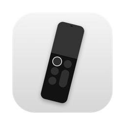
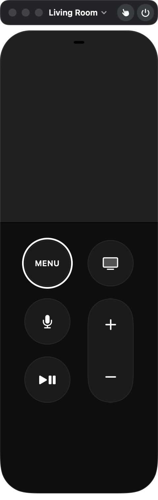

<p align="center"></p>

# TV Remote

Control your Apple TV from your Mac. A small native SwiftUI app that looks and works like the
Siri Remote, in a window with the usual traffic lights, and tucks into the menu bar when you
close it.

<p align="center"></p>

## Install

```sh
brew install --cask explodingcb/tap/tv-remote
```

Upgrade with `brew upgrade --cask tv-remote`, remove with `brew uninstall --cask tv-remote`,
and use `brew uninstall --zap --cask tv-remote` to also delete its settings and pairing.

Requires macOS 15 or later on Apple Silicon or Intel.

## First launch

1. The first launch sets up a private Python environment in
   `~/Library/Application Support/TV Remote/` with [pyatv](https://pyatv.dev), the library
   that speaks Apple TV's Companion protocol. It takes a few seconds and only happens once.
   It uses [uv](https://github.com/astral-sh/uv), which the cask installs for you.
2. Click **Allow** when macOS asks for Local Network access.
3. Pick your Apple TV from the menu at the top of the window. A 4-digit code appears on the
   TV; type it in. After that the app reconnects on its own.

## Using it

| | Mouse / trackpad | Keyboard |
| --- | --- | --- |
| Move | Drag on the touch surface, or two-finger swipe | Arrow keys |
| Select | Click the touch surface | Return |
| Long press | Click and hold | |
| Menu / Back | MENU (hold for the Home screen) | Esc / Delete |
| TV / Home | TV button (hold for Control Center) | H |
| Play / Pause | ⏯ | Space |
| Volume | + / − (hold to repeat) | + / − |
| Type on the TV | Mic button (opens by itself when a text field is focused on the TV) | K |
| Sleep / Wake | Power button in the top bar | ⇧⌘P |

**Trackpad mode (⌘T).** Your whole Mac trackpad becomes the remote's touch surface. The
cursor is parked and hidden, finger positions map straight onto the Siri Remote's pad, and a
physical click selects. Press ⌘T again, or switch apps, to get the cursor back.

**Menu bar.** Closing or hiding the window sends TV Remote to the menu bar. Click the icon
to bring the remote back; right-click it for Play/Pause, Home, Sleep/Wake, and Launch at
Login.

The **Remote** menu also has Screen Saver, a D-pad control style, Keep Window on Top (⌥⌘T),
and Forget This Apple TV.

## Build from source

```sh
./build.sh            # universal build into build/TV Remote.app
./build.sh --install  # also copies it to /Applications
```

Needs Xcode 16 or later. Releases are cut with `scripts/release.sh <version> "<notes>"`, which
builds, zips, publishes the GitHub release, and updates the cask in
[ExplodingCB/homebrew-tap](https://github.com/ExplodingCB/homebrew-tap).

## How it works

- `Sources/TVRemote/`: the SwiftUI app. Apple TVs are found through the system's Bonjour
  service, then handed to the bridge by IP.
- `Resources/atv_bridge.py`: a small [pyatv](https://github.com/postlund/pyatv) process the
  app talks to over line-delimited JSON on stdin/stdout. Its log is
  `~/Library/Application Support/TV Remote/bridge.log`.
- Pairing credentials stay on your Mac, in
  `~/Library/Application Support/TV Remote/pyatv.conf`.

The app is ad-hoc signed rather than notarized, so the cask clears the quarantine flag after
installing.

TV Remote is an independent project and isn't affiliated with or endorsed by Apple. Apple TV
and Siri Remote are trademarks of Apple Inc.

## License

MIT
